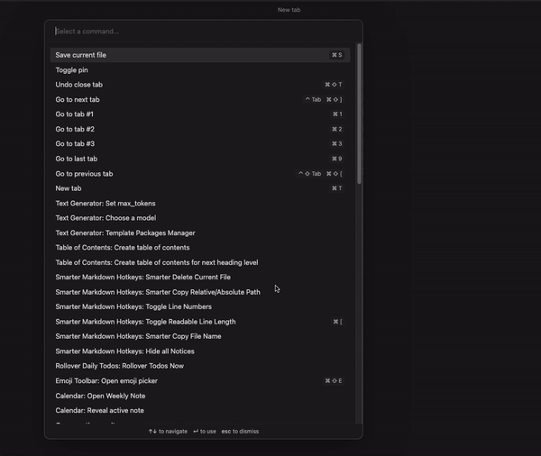
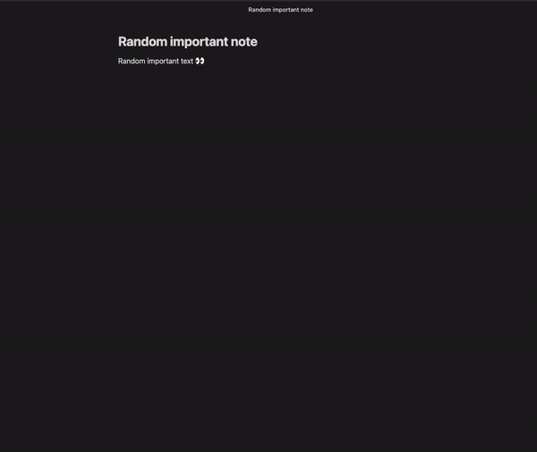

# Obsidian Daily Inspirational Quote

This plugin adds an inspirational quote automatically to your new daily notes.

Please note that this plugin is not listed in the official [Obsidian plugin list](https://obsidian.md/plugins), and it will not be uploaded there.

Big thanks to [Quotable](https://quotable.io/) for providing free public API. ❤️

## Installing the plugin

Since this plugin is not part of the official Obsidian plugin list, you need to manually install it.

Follow these steps:

1. Go to your vault plugins folder. to your vault `VaultFolder/.obsidian/plugins/`
2. Create a folder called `daily-inspirational-quote`
3. Download `main.js`, `styles.css`, `manifest.json` files from the latest [release](https://github.com/clivelewis/obsidian-daily-inspirational-quote/releases).

## Example usage
- Automatically generated quote when new daily note is created.

- Manually add quote to any note using a Command palette.

